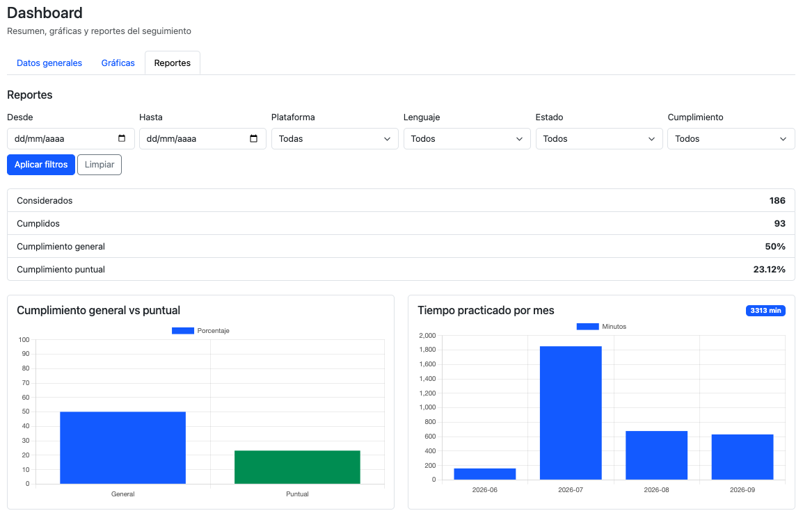
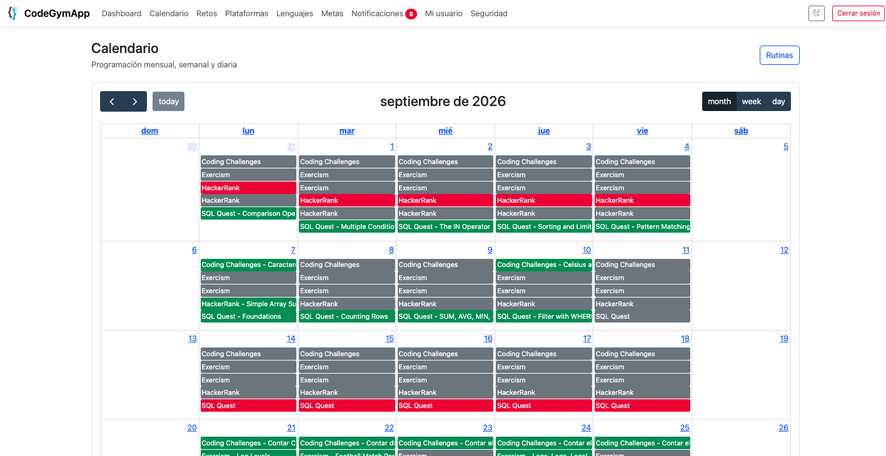
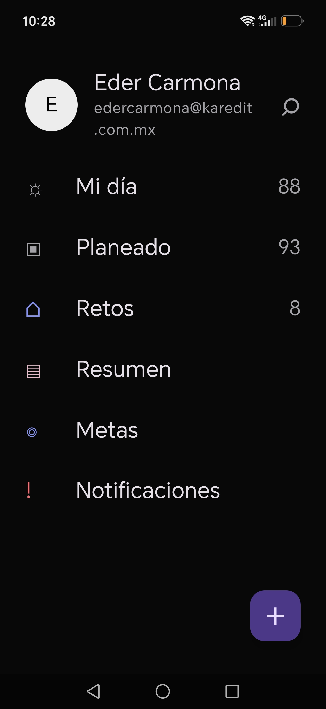

# CodeGymApp

Sistema personal para planear, registrar y revisar retos de programación desde una web privada y una app Android conectada al mismo backend.

## El problema

Practicar programación de forma constante suele terminar repartido entre calendarios, notas, hojas de cálculo, plataformas como LeetCode o HackerRank y enlaces sueltos a soluciones. Con el tiempo es fácil perder de vista qué reto tocaba hoy, cuáles quedaron vencidos, cuánto se practicó, qué lenguajes se usaron y si las metas semanales o mensuales realmente avanzan.

CodeGymApp está pensado para una persona que estudia o entrena programación de manera disciplinada y necesita un registro centralizado. Sin una herramienta así, el seguimiento depende de memoria y registros manuales dispersos, lo que dificulta mantener rachas, revisar pendientes y medir progreso real.

## La solución

CodeGymApp centraliza el seguimiento de práctica en una aplicación privada:

1. El usuario crea un calendario de retos o rutinas repetitivas.
2. El sistema genera y muestra los retos pendientes, vencidos, cumplidos, no cumplidos o cancelados.
3. Al completar un reto, el usuario registra plataforma, título, dificultad, tiempo invertido, lenguajes, notas y enlaces de GitHub.
4. El dashboard y los reportes calculan métricas, rachas, distribución por estado, plataformas y lenguajes.
5. La app Android permite consultar y actualizar el progreso desde el móvil, incluso con cola local para trabajo offline.
6. Las notificaciones internas y push ayudan a recordar retos pendientes de hoy o vencidos por revisar.

## Funcionalidades principales

- Login privado con JWT, cookie `HttpOnly` para web y `Authorization: Bearer` para Android.
- Creación de un único usuario inicial mediante `tools/create_user.php`.
- Calendario de retos con FullCalendar.
- Rutinas diarias, semanales y mensuales.
- Registro manual de retos ya realizados.
- Estados de retos: pendiente, completado, vencido, no cumplido y cancelado.
- Detalles de reto: plataforma, título, URL, dificultad, tiempo, notas, lenguajes y enlaces de GitHub.
- Catálogos de plataformas y lenguajes activables/desactivables.
- Metas semanales, mensuales y anuales por cantidad de retos, tiempo de práctica o racha.
- Dashboard con métricas, rachas, datos de atención y gráficas.
- Reportes filtrables por fechas, plataforma, lenguaje, estado y tipo de cumplimiento.
- Notificaciones internas con marcado como leído y eliminación.
- Bitácora de seguridad.
- Modo claro/oscuro.
- API JSON para la app Android.
- App Android nativa con Kotlin, Jetpack Compose, Room cifrado, sincronización offline y Firebase Cloud Messaging.
- Integración opcional con Azure Notification Hubs para push.
- Endpoints de cron para recordatorios móviles.

## ¿Qué mejora este proyecto?

- Reduce la dependencia de notas o calendarios separados para saber qué practicar.
- Permite distinguir retos pendientes, vencidos y completados sin revisar varias plataformas.
- Conserva historial de práctica por fecha, plataforma y lenguaje.
- Ayuda a medir constancia mediante rachas, metas y reportes.
- Facilita registrar soluciones y enlaces de GitHub junto al reto correspondiente.
- Permite continuar usando la app Android cuando no hay conexión y sincronizar después.
- Mantiene un registro de eventos de seguridad e intentos de acceso.

## ¿Para quién está pensado?

El proyecto está pensado principalmente para uso personal: estudiantes, desarrolladores o personas que practican algoritmos, entrevistas técnicas o programación competitiva y quieren controlar su progreso de forma privada.

El esquema actual fuerza un solo usuario principal mediante una clave única en la tabla `users`; no está diseñado como plataforma multiusuario pública.

## Capturas

### Dashboard



### Calendario



### App Android




## Tecnologías utilizadas

- PHP 8.3: backend web, API, controladores, servicios y modelos.
- MySQL 8 o MariaDB reciente: persistencia principal.
- Apache con `.htaccess`: reescritura de rutas y bloqueo de archivos internos.
- HTML, CSS y JavaScript: interfaz web.
- FullCalendar: calendario visual de retos.
- Chart.js: gráficas del dashboard y reportes.
- HTMX: actualización parcial de tablas y vistas.
- Kotlin: app Android nativa.
- Jetpack Compose y Material 3: interfaz móvil.
- Retrofit, OkHttp y Moshi: consumo de API en Android.
- Room, SQLCipher y Android Keystore: caché local cifrada y almacenamiento seguro en Android.
- Firebase Cloud Messaging: token push en Android.
- Azure Notification Hubs: entrega opcional de notificaciones push desde el backend.

## Requisitos

### Backend web

- Apache con `mod_rewrite` y soporte para `.htaccess`.
- PHP `^8.3`, según `composer.json`.
- Extensión PDO MySQL habilitada.
- MySQL 8 o MariaDB reciente con InnoDB y `utf8mb4`.
- HTTPS recomendado para cookies seguras y para la app Android.

Composer no es obligatorio para producción en cPanel porque el proyecto incluye su propio autoload en `app/core/bootstrap.php`. `composer.json` documenta el mapeo PSR-4 para herramientas modernas.

### Android

- Android Studio compatible con Android Gradle Plugin 8.5.2.
- JDK 17.
- `compileSdk` 35, `targetSdk` 35 y `minSdk` 23.
- Gradle Wrapper incluido en `android/`.
- `google-services.json` solo si se va a usar Firebase Cloud Messaging.

## Instalación

### Backend en cPanel o hosting Apache

1. Clona o sube el repositorio a la carpeta pública del subdominio.
2. Verifica que `index.php`, `.htaccess`, `app/`, `config/`, `database/`, `public/`, `routes/`, `storage/` y `tools/` queden en la misma raíz.
3. Crea una base de datos MySQL vacía.
4. Crea un usuario MySQL y asígnalo a la base de datos.
5. Importa `database/install.sql` desde phpMyAdmin.
6. Copia `.env.example` como `.env`.
7. Configura las variables de entorno.
8. Abre `https://tu-subdominio/tools/create_user.php` y crea el usuario inicial.
9. Confirma que `tools/create_user.php` se borre automáticamente. Si no ocurre, elimínalo manualmente.
10. Entra a `/login`.

### Backend en entorno local

Para una prueba local básica con el servidor embebido de PHP:

```bash
cp .env.example .env
php -S localhost:8000 index.php
```

También debes tener una base MySQL accesible, importar `database/install.sql` y completar `.env` antes de iniciar sesión.

### Android

```bash
cd android
./gradlew test
./gradlew assembleDebug
```

En Windows puedes usar:

```bash
cd android
gradlew.bat test
gradlew.bat assembleDebug
```

Luego abre la carpeta `android/` en Android Studio para ejecutar la app en un emulador o dispositivo físico.

## Configuración

Las variables se toman de `.env`. No subas este archivo al repositorio.

```env
APP_NAME="CodeGymApp"
APP_ENV=production
APP_DEBUG=false
APP_URL=https://subdominio.tudominio.com

DB_HOST=localhost
DB_NAME=nombre_bd
DB_USER=usuario_bd
DB_PASS=password_bd
DB_CHARSET=utf8mb4

JWT_SECRET=pega_aqui_una_clave_hexadecimal_de_64_caracteres
JWT_EXPIRES_MINUTES=30

LOGIN_MAX_ATTEMPTS=3
LOGIN_BLOCK_MINUTES=30

RATE_LIMIT_ENABLED=true
RATE_LIMIT_REQUESTS=120
RATE_LIMIT_WINDOW_SECONDS=60
CRON_SECRET=clave_larga_para_cron

NOTIFICATION_HUB_ENABLED=false
NOTIFICATION_HUB_NAME=
NOTIFICATION_HUB_CONNECTION_STRING=
NOTIFICATION_HUB_PLATFORM=fcmv1
NOTIFICATION_HUB_SEND_FORMAT=fcmv1
```

Variables importantes:

- `APP_URL`: dominio público donde vive la app.
- `APP_DEBUG`: debe ser `false` en producción.
- `DB_*`: conexión a MySQL o MariaDB.
- `JWT_SECRET`: clave privada para firmar tokens. Genera una nueva con `openssl rand -hex 32`.
- `JWT_EXPIRES_MINUTES`: duración del JWT.
- `LOGIN_MAX_ATTEMPTS` y `LOGIN_BLOCK_MINUTES`: bloqueo por intentos fallidos.
- `RATE_LIMIT_*`: límite ligero por IP antes de consultar MySQL.
- `CRON_SECRET`: secreto requerido por endpoints de cron.
- `NOTIFICATION_HUB_*`: configuración opcional de Azure Notification Hubs.

## Base de datos

El motor principal es MySQL o MariaDB con tablas InnoDB. El instalador está en:

```text
database/install.sql
```

Ese script crea tablas para:

- usuario único;
- plataformas;
- lenguajes;
- rutinas;
- retos;
- lenguajes por reto;
- enlaces de GitHub por reto;
- metas;
- notificaciones;
- tokens de dispositivos móviles;
- bitácora de seguridad.

También inserta plataformas y lenguajes base. No crea el usuario de la aplicación; ese paso se realiza con `tools/create_user.php`.

Scripts adicionales:

- `database/mobile_device_tokens.sql`: agrega la tabla de tokens móviles si la base existía antes.
- `database/mobile_push_preferences.sql`: agrega preferencias móviles si la base existía antes.
- `database/cleanup_test_data.sql`: elimina datos de prueba sin borrar usuario ni catálogos base.

Antes de ejecutar scripts de limpieza o cambios manuales, exporta un respaldo desde phpMyAdmin.

## Ejecutar el proyecto

En hosting Apache, la entrada pública es:

```text
index.php
```

Con `.htaccess` activo, las rutas funcionan como `/login`, `/calendario`, `/dashboard` y `/api/...`.

En local:

```bash
php -S localhost:8000 index.php
```

URL local típica:

```text
http://localhost:8000/login
```

## Uso

1. Instala la base de datos e importa `database/install.sql`.
2. Configura `.env`.
3. Crea el usuario inicial desde `/tools/create_user.php`.
4. Inicia sesión en `/login`.
5. Configura plataformas y lenguajes si necesitas catálogos adicionales.
6. Crea retos desde `/calendario` o registra retos ya realizados desde `/retos`.
7. Crea rutinas para generar práctica repetitiva.
8. Completa, reprograma, cancela o marca retos como no cumplidos.
9. Registra detalles del reto completado: tiempo, dificultad, lenguajes, notas y GitHub.
10. Define metas desde `/metas`.
11. Consulta progreso en `/dashboard`, reportes y notificaciones.
12. Revisa eventos de acceso en `/seguridad`.

En Android, el flujo inicia con `POST /api/auth/login`. La app guarda el JWT en almacenamiento cifrado, consulta los endpoints móviles y sincroniza cambios offline cuando recupera conexión.

## API principal

La API vive en el mismo dominio con rutas `/api/...`.

Autenticación:

- `POST /api/auth/login`
- `GET /api/me`

Calendario y retos web:

- `GET /api/calendar/bootstrap`
- `GET /api/calendar/events`
- `POST /api/calendar/store`
- `POST /api/calendar/save-details`
- `POST /api/calendar/complete`
- `POST /api/calendar/miss`
- `POST /api/calendar/cancel`
- `POST /api/calendar/update-date`
- `GET /api/challenges/list`
- `POST /api/challenges/manual`

Endpoints móviles:

- `GET /api/mobile/today`
- `GET /api/mobile/planned`
- `GET /api/mobile/challenges`
- `GET /api/mobile/summary`
- `GET /api/mobile/notifications`
- `POST /api/mobile/challenges/store`
- `POST /api/mobile/challenges/manual`
- `POST /api/mobile/challenges/save-details`
- `POST /api/mobile/challenges/complete`
- `POST /api/mobile/challenges/miss`
- `POST /api/mobile/challenges/reschedule`
- `POST /api/mobile/challenges/cancel`
- `POST /api/mobile/routines/store`
- `GET /api/mobile/goals`
- `POST /api/mobile/goals/store`
- `POST /api/mobile/goals/update`
- `POST /api/mobile/device-token`
- `POST /api/mobile/settings`

Cron móvil:

- `POST /api/cron/mobile/today-reminder`
- `POST /api/cron/mobile/expired-review-reminder`

Los endpoints protegidos aceptan JWT por `Authorization: Bearer <TOKEN>` o por cookie web activa, según el cliente.

## Recordatorios push

Para activar Azure Notification Hubs:

```env
NOTIFICATION_HUB_ENABLED=true
NOTIFICATION_HUB_NAME=nombre_del_hub
NOTIFICATION_HUB_CONNECTION_STRING="Endpoint=sb://...;SharedAccessKeyName=...;SharedAccessKey=..."
NOTIFICATION_HUB_PLATFORM=fcmv1
NOTIFICATION_HUB_SEND_FORMAT=fcmv1
```

Ejemplo de cron en cPanel:

```bash
curl -fsS -X POST -H "X-Cron-Secret: TU_CRON_SECRET" "https://tu-subdominio/api/cron/mobile/today-reminder"
curl -fsS -X POST -H "X-Cron-Secret: TU_CRON_SECRET" "https://tu-subdominio/api/cron/mobile/expired-review-reminder"
```

No envíes `CRON_SECRET` en la URL porque los query strings suelen quedar registrados en logs del servidor.

## Estructura

```text
app/
  controllers/   Controladores web y API.
  core/          Bootstrap, router, configuración, JWT, respuesta, sesión y errores.
  helpers/       Funciones auxiliares y estado de tablas.
  models/        Consultas SQL y persistencia.
  services/      Lógica de aplicación y validaciones.
  views/         Vistas PHP, layouts y parciales.
android/         App Android nativa.
config/          Configuración PHP.
database/        SQL de instalación y mantenimiento.
docs/            Documentación técnica móvil y despliegue.
public/          CSS, JavaScript e imágenes públicas.
routes/          Definición de rutas.
tools/           Herramientas de instalación, incluido creador de usuario inicial.
```

## Seguridad

- No guardes contraseñas, tokens ni claves reales en el código.
- Usa `.env` para secretos y conserva `.env.example` solo con valores de ejemplo.
- No subas `.env`, `google-services.json` ni credenciales privadas.
- Genera `JWT_SECRET` y `CRON_SECRET` con valores largos y aleatorios.
- Usa HTTPS en producción.
- El archivo `.htaccess` debe impedir acceso directo a carpetas internas como `app/`, `database/`, `routes/` y `storage/`.
- Después de crear el usuario inicial, elimina `tools/create_user.php` si el script no se borró automáticamente.
- Reporta vulnerabilidades de forma responsable al mantenedor del repositorio.

La app Android declara `usesCleartextTraffic="false"` y usa almacenamiento cifrado para JWT y datos locales.

## Pruebas

El repositorio incluye pruebas unitarias Android en `android/app/src/test`.

Ejecutar pruebas Android:

```bash
cd android
./gradlew test
```

En Windows:

```bash
cd android
gradlew.bat test
```

No se encontró una suite automatizada equivalente para el backend PHP. Para cambios en PHP, usa al menos el checklist manual de regresión de este README.

## Checklist de regresión manual

- Login correcto redirige a `/calendario`.
- Login incorrecto muestra error y registra evento en `/seguridad`.
- Logout regresa a `/login`.
- Dashboard carga métricas, gráficas y reportes.
- Calendario carga eventos del mes.
- Crear reto desde calendario.
- Editar detalle de reto.
- Completar, reprogramar, cancelar y marcar reto como no cumplido.
- Crear rutina diaria, semanal y mensual.
- Editar o desactivar rutina y confirmar que cambia el calendario.
- `/retos` filtra, ordena y pagina.
- Registro manual de reto valida campos obligatorios.
- Crear meta y desactivar meta.
- Crear, editar, activar y desactivar plataforma.
- Crear, editar, activar y desactivar lenguaje.
- Notificaciones permiten marcar como leída y eliminar.
- Usuario permite actualizar perfil, tema y contraseña.
- Seguridad muestra eventos recientes.
- `.env` no es accesible desde navegador.

## Estado del proyecto

El proyecto parece una versión funcional en desarrollo activo. Cuenta con backend web, API, app Android, documentación técnica móvil y scripts de instalación, pero conserva limitaciones claras como usuario único y ausencia de pruebas automatizadas para PHP.

## Limitaciones actuales

- El sistema está diseñado para un solo usuario principal, no para múltiples cuentas independientes.
- No se encontró recuperación de contraseña por correo.
- El backend PHP no incluye suite automatizada de pruebas en el repositorio.
- No se encontraron migraciones versionadas; la instalación depende de scripts SQL.
- La integración push requiere servicios externos configurados fuera del repositorio: Firebase y Azure Notification Hubs.
- La URL base Android está definida en `android/app/build.gradle`; para otro entorno debe ajustarse antes de compilar.

## Próximas mejoras

- Agregar migraciones versionadas para cambios de base de datos.
- Incorporar pruebas automatizadas para servicios y controladores PHP.
- Documentar un flujo de cambio de contraseña o recuperación si se implementa.
- Agregar capturas reales de web y Android en `docs/images`.
- Externalizar la URL base Android por variante de build o configuración segura.
- Añadir exportación de reportes si se requiere análisis externo.
- Preparar soporte multiusuario solo si el modelo del producto cambia.

## Despliegue desde Git en cPanel

1. Entra a Git Version Control.
2. Abre el repositorio de `codegymapp`.
3. Confirma que la rama activa sea la que contiene el backend PHP para hosting.
4. Usa Actualizar desde remoto.
5. Usa Desplegar commit HEAD.
6. Si cambiaron CSS o JavaScript, recarga el navegador con caché limpio.

Después del despliegue revisa `/login`, `/calendario`, `/dashboard`, `/retos`, `/metas`, `/notificaciones` y `/seguridad`.

## Contribuciones

1. Haz un fork del repositorio.
2. Crea una rama para tu cambio:

```bash
git checkout -b feature/nueva-funcionalidad
```

3. Realiza cambios pequeños y enfocados.
4. Actualiza documentación si cambia el comportamiento.
5. Ejecuta las pruebas disponibles:

```bash
cd android
./gradlew test
```

6. Revisa manualmente las rutas afectadas del backend.
7. Abre un Pull Request explicando el problema resuelto, el enfoque y las pruebas realizadas.

## Licencia

Este proyecto está publicado bajo licencia MIT. Consulta `LICENSE` para el texto completo.
